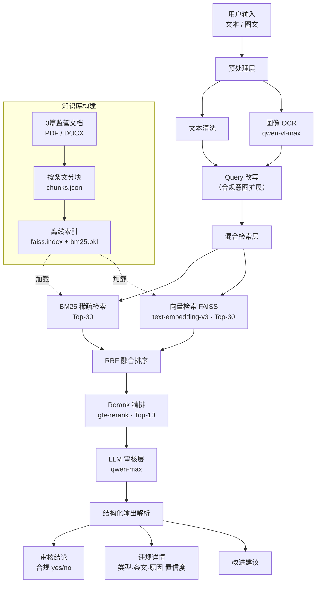

# 保险营销内容智能审核系统

> 实操考题：基于大模型的保险营销内容智能审核

## 快速开始

```bash
# 安装依赖
pip install -r requirements.txt

# 配置 API Key（百炼平台）
export BAILIAN_API_KEY=sk-xxx   # 或写入 .env 文件

# 运行 Demo（内置 5 条测试用例）
python scripts/demo.py

# 审核单条文案
python scripts/demo.py "本产品保本保息，年化收益5%稳稳到手"

# 运行效果评估（38条标注样本）
python scripts/evaluate.py
```

---

## 系统架构



---

## 关键设计说明

见 [docs/design.md](docs/design.md)

---

## 目录结构

```
reviewer/
├── src/
│   ├── pipeline.py          # 主编排器
│   ├── retrieval/           # 混合检索（BM25 + 向量 + Rerank）
│   ├── llm_review/          # Prompt 构建 + LLM 调用 + 输出解析
│   ├── multimodal/          # 图像 OCR（qwen-vl-max）
│   ├── indexing/            # 索引构建工具
│   ├── evaluation/          # 评估指标（Precision / Recall / F1）
│   └── config/              # 配置、违规类型定义
├── data/
│   ├── references/          # 3篇监管原文
│   ├── chunks/              # 条文分块（chunks.json）
│   └── indexes/             # 预构建索引
├── tests/
│   └── golden_set.py        # 38条标注样本
├── scripts/
│   ├── demo.py              # 演示入口
│   └── evaluate.py          # 评估入口
└── docs/
    └── design.md            # 关键设计说明
```

---

## 支持的违规类型

| ID  | 类型               |
|-----|--------------------|
| V01 | 承诺本金不受损失   |
| V02 | 夸大或承诺收益     |
| V03 | 绝对化/极限化用语  |
| V04 | 缺失风险提示       |
| V05 | 无资质代言         |
| V06 | 虚假/误导性信息    |
| V07 | 违规比较竞品       |
| V08 | 隐瞒关键信息       |
| V09 | 诱导性语言         |
| V10 | 违规承诺服务       |
| V11 | 其他合规违规       |
