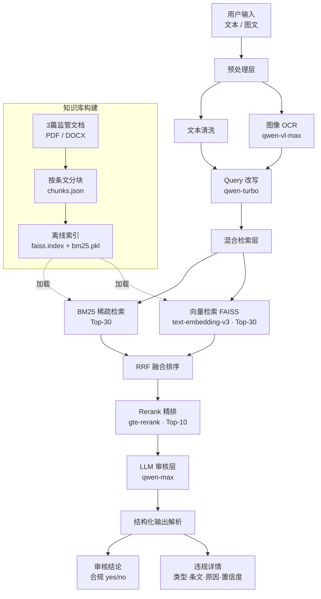

# 保险营销内容智能审核系统

## 快速开始

```bash
# 安装依赖
pip install -r requirements.txt

# 配置 API Key（百炼平台）
export BAILIAN_API_KEY=sk-xxx   # 或写入 .env 文件

# 运行 Demo（内置 5 条测试用例）
python scripts/demo.py

# 审核单条文案
python scripts/demo.py "本产品保本保息，年化收益5%稳稳到手"

# 运行效果评估
python scripts/evaluate.py --golden-set tests/golden_set/short.json
python scripts/evaluate.py --golden-set tests/golden_set/long.json
```

---

## 系统架构



---

## 关键设计说明

见 [design.md](docs/design.md)，涵盖：

- 技术路径选择（RAG + Prompt Engineering）
- 知识库按条文粒度分块 + 条款上下文依赖处理
- 混合检索：BM25 + 向量 + RRF + Rerank
- Query 改写捕捉隐式违规
- Prompt 结构与输出约束
- 多模态支持（qwen-vl-max OCR）
- 效果评估模块

---

## 输出展示报告

见 [demo_output.md](docs/demo_output.md)

---

## 评测报告

| 样本集 | 说明 | 报告 |
|--------|------|------|
| short golden set | V01-V09 典型正例 + 反例 + 边界 case | [查看](tests/evaluation_report/report_20260423_114624.md) |
| long golden set  | 多违规叠加、隐式违规等高难度样本     | [查看](tests/evaluation_report/report_20260423_114258.md) |

---

## 目录结构

```
reviewer/
├── src/
│   ├── pipeline.py          # 主编排器
│   ├── retrieval/           # 混合检索（BM25 + 向量 + Rerank）
│   ├── llm_review/          # Prompt 构建 + LLM 调用（qwen-max）+ 输出解析
│   ├── multimodal/          # 图像 OCR（qwen-vl-max）
│   ├── indexing/            # 索引构建工具
│   ├── evaluation/          # 评估指标（合规二分类准确率）
│   └── config/              # 配置、违规类型定义（V01-V09）
├── data/
│   ├── references/          # 3篇监管原文
│   ├── chunks/              # 条文分块（chunks.json，按条文粒度）
│   └── indexes/             # 预构建索引（faiss.index + bm25.pkl）
├── tests/
│   ├── golden_set/          # 标注样本（short.json / long.json）
│   └── evaluation_report/   # 历次评估 Markdown 报告
├── scripts/
│   ├── demo.py              # 演示入口
│   └── evaluate.py          # 评估入口（自动生成报告）
└── docs/
    ├── design.md            # 关键设计说明
    └── demo_output.md       # 输出展示报告
```

---

## 支持的违规类型

| ID  | 类型              |
| --- | ----------------- |
| V01 | 承诺本金不受损失  |
| V02 | 夸大或承诺收益    |
| V03 | 绝对化/极限化用语 |
| V04 | 无资质或不当代言  |
| V05 | 误导性产品比较    |
| V06 | 隐瞒/淡化费用     |
| V07 | 诱导退保/转保     |
| V08 | 伪造/篡改备案信息 |
| V09 | 违规承诺增值服务  |
